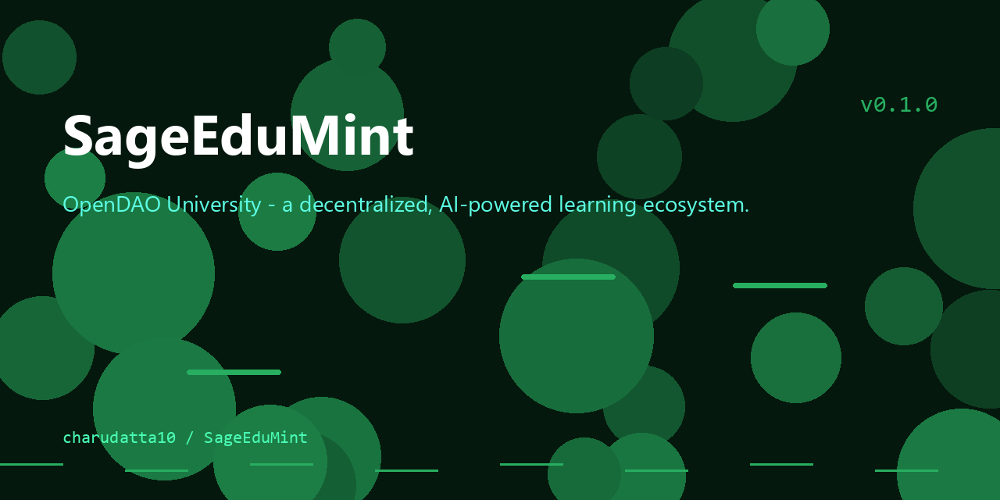

# OpenDAO University

<p align="center">
  
</p>


This is the official repository for OpenDAO University, a decentralized, AI-powered learning ecosystem.

## About

OpenDAO University is a project to create a new kind of university, one that is open, decentralized, and governed by its learners. For more information, please see the [white paper](white_paper.md).

## Features

- Decentralized, AI-powered learning ecosystem
- Credentialing and credential-minting system
- Adaptive learning engine
- Governance, licensing, and registration modules
- DHT-based credential manager service

## Getting Started

To get started, you will need to have the following installed:

*   [Node.js](https://nodejs.org/)
*   [Git](https://git-scm.com/)

Once you have these installed, you can clone the repository and install the dependencies:

```
git clone https://github.com/your-username/open_uni.git
cd open_uni
npm install
```

## Usage

To start the development server, run the following command:

```
npm run dev
```

This will start the server on [http://localhost:3000](http://localhost:3000).

## Contributing

Contributions are welcome! Please see the [contributing guide](CONTRIBUTING.md) for more information.

## License

This project is licensed under the MIT License. See the [LICENSE](LICENSE) file for more information.